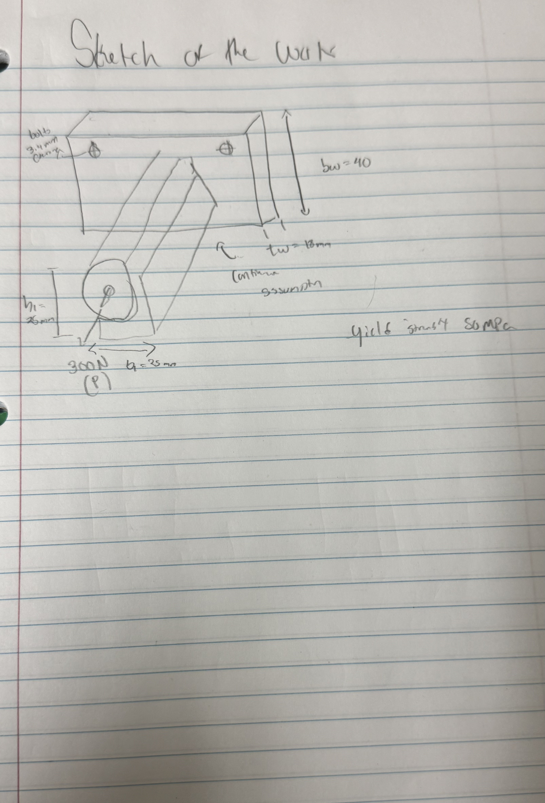
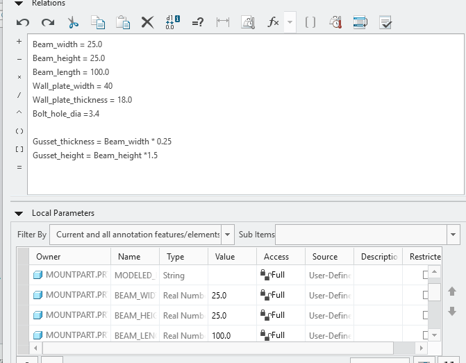
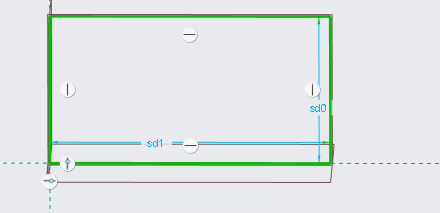
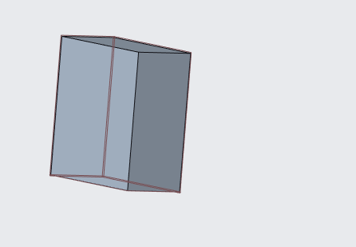
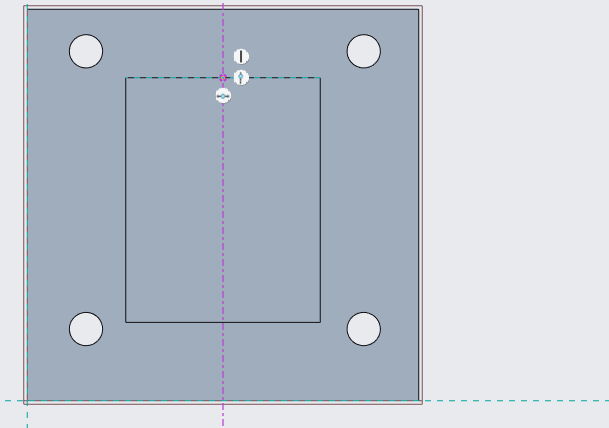
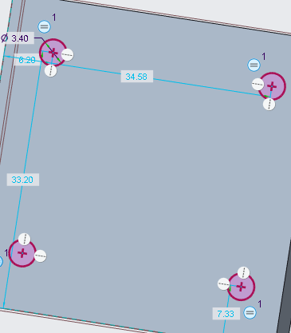
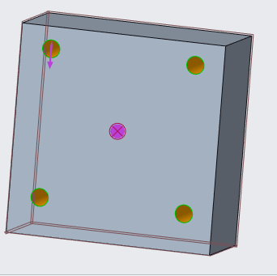

# A4 – [Motor Mount]
For this assignment we're told to created a motor mount design according to the given specific dimensions. I decided to create my mount based off of what I've seen before deciding to use my own memory rather than another persons creation from the internet.    
## Feature1
To begin I had to create the equations that would model what would be created in creo parametric. I started with listing my knowns which was the load force of 300 newtons, the safety factor of 3, the max displacement of 0.3 m, the modulus of elastic of PLA which was 3.5 Gpa and the total length of the motor which I measured from the given design to be about 1m. 
<figure>
 
<figcaption> The first page listing knowns, unknowns and the FBD for the first part of the mount</figcaption>
</figure>

<figure>
  
  <figcaption> This second page shows off more equations for finding unknowns smbolically.</figcaption>
</figure>

<figure>
  
  <figcaption> This third page shows off the solving of equations using numbers and the beginning of modeling</figcaption>
</figure>

Next after designing my first parts equations I would do the same for the second Feature 
## Feature2

Again for feature two like feature 1 I would start by finding my knowns and unknown equations to have a better understanding of my cad modeling. 

<figure>
   
  <figcaption> This page shows off my unknowns, my knowns and my FBD</figcaption>
</figure>

<Figure>
  
  <figcaption> This page shows off symbolic and numarical solving for feature 2</figcaption>
</Figure>

## Sketch 

For the sketch I decided to base it again off a model I've seen in real life when doing my 1201 project. I had the idea to try to put a motor that we had on the car and imagine what it would look like if it was attached to a wall and this is what I came up with. 

<Figure>
   
  <figcaption> This is a basic model of what I want my cad design to look like numbers from figures 1 and 2 calculatons</figcaption>
</Figure>
## Cad design 

To begin the cad design I started with putting in my parametric equations for the design
<figure>
  
  <figcaption> This image shows off my parametric equations for my cad design </figcaption>
</figure>

Next I would begin creating the base or figure 1 for my cad design 
<figure>
  
  <figcaption> The base numbers are auto set from the parametric equations </figcaption>
</figure>

Then I would extrude this part to the again parametric thickness 
<figure>
  
  <figcaption>This shows off the base of the build</figcaption>
</figure>

Next I would create the holes and create a constraint to make them equal to each other, the radii for my holes would be given by the A4 design constraint. But before that I would have to put a centerline to create a placement of the holes exactly the same distances from the middle. 

<figure>
  
  <figcaption> This is my centerline given parametric equations for distance</figcaption>
</figure>

And this is my Radii 

<figure>
  
  <figcaption> This is my radii given showing the 3.4</figcaption>
</figure>

Next I would extrude the holes to create the clearance holes for the part 
<figure>
  
  <figcaption>This shows off the clearance holes being created</figcaption>
</figure>

After this I would create another box this time to hold the actual motor into place 
<figure>
  
  <figcaption> As previously stated the length is 100 mm but this was a mistake and was only 20mm</figcaption>
</figure>

Then I would fix that mistake and actually create the extrude to be 100mm
<figure>
  
  <figcaption>The length is now 100 mm/figcaption>
</figure>

Lastly I would create another extrude onto the last figure with the radius being the exact diameter of the motor so it can be designed to fit. 
<figure>
  
  <figcaption>The created motor mount placement </figcaption>
</figure>

## Communicate

