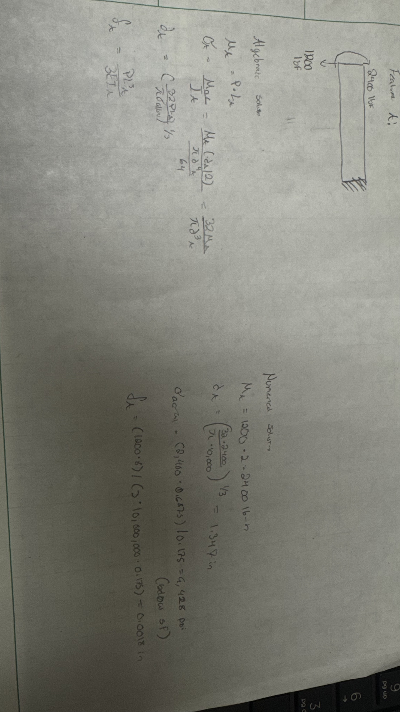
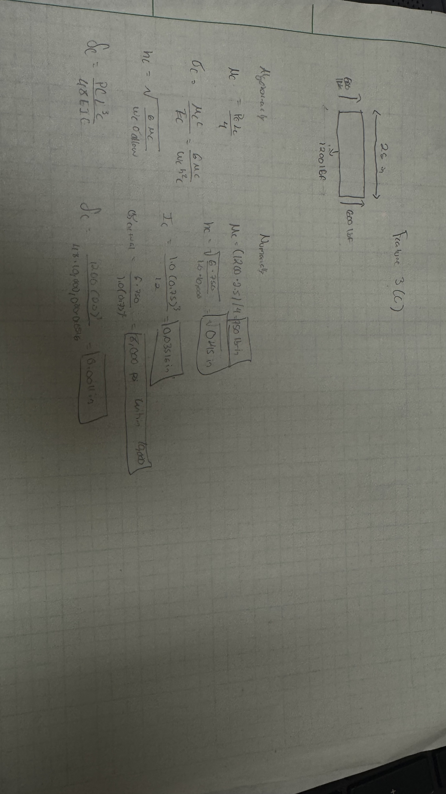
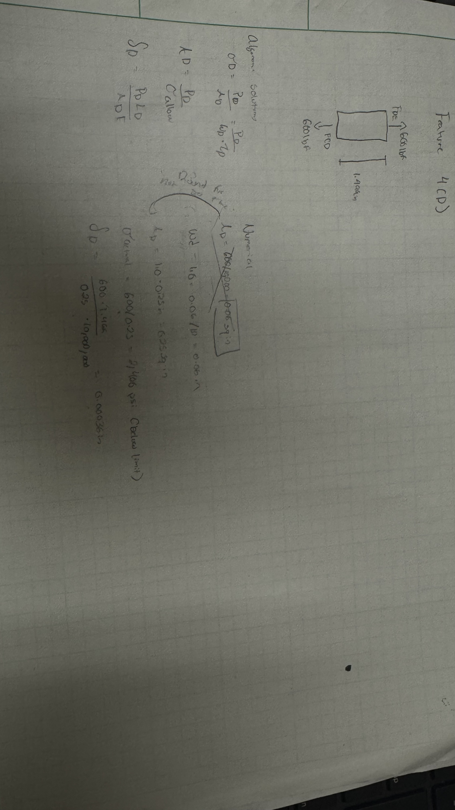
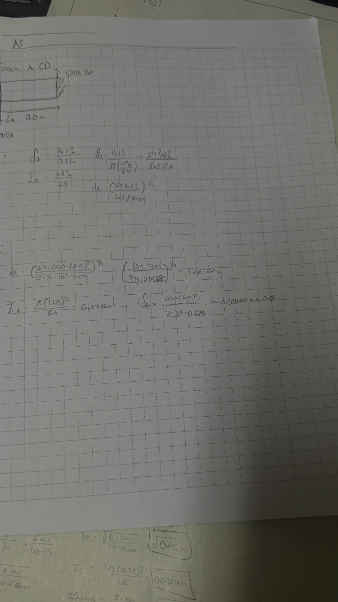
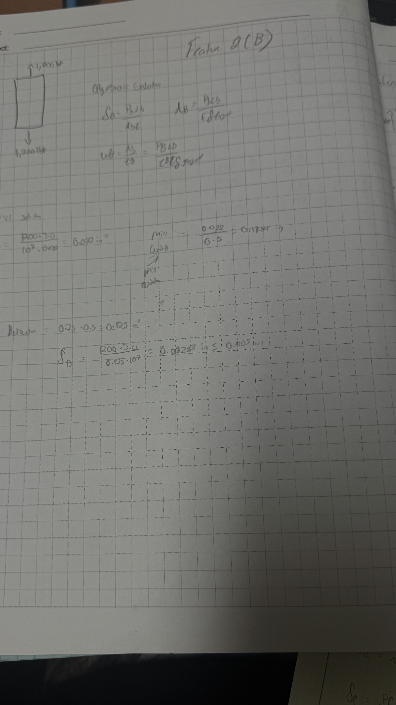

# A5 – [Bracket Design]

## Design Parameters and Assumptions: 
<ul>
  <li>Aluminum 6016-T6 chosen material</li>
  <li>Yield strength = 40,000 psi</li>
  <li>Youngs modulus (E) = 10,000,000 Psi</li>
  <li>Safety Factor = 4</li>
  <li>Assumption = No failure will occur due to failure</li>
  <li>Chosen applied load = 600 lbf</li>
</ul>

## Feature 1 (A) Stress Analysis : 

Knowns: 
  <ul>
    <li>Two downward force = 1200 since two downward forces applied</li>
    <li>Allowable stress = 10,000 psi</li>
    <li>Assumed length = 2 in</li>
  </ul>

Unknowns: 
  <ul> 
    <li>The required cross sectional diameter of cylinder pin</li>
    <li>The max internal bending stress</li>
    <li>The max deflection of the free end</li>
  </ul>

Assumptions: 
<ul>
  <li>This feature is perfectly cylindrical and will fit to feature B</li>
  <li>The deflection will be small compared to the length. </li>
</ul>

## FBD and equations: 
<figure>
  
  <figcaption> The Freebody diagram of the circular bar treated as a cantilever beam</figcaption>
</figure>

## Feature 2 (B) Stress Analysis: 

Knowns:
  <ul> 
    <li>Force  P = 1200 downward direct shear from feature 1(A) </li>
    <li>Allowed stress = 10,000</li>
  </ul>

Unknowns: 
  <ul>
    <li>The required length of the link</li>
    <li>The cross sectional area</li>
    <li>The max deflection</li>
  </ul>

Assumptions: 
<ul>
  <li>B is a two force member</li>
  <li>The axial load is unform throughout the bar</li>
  <li>Feature A gives no bending moment to feature B</li>
  <li>Link length is 3 in</li>
  <li>Link thickness is 0.5 in</li>
</ul>

## FBD and equations: 
<figure>
   
  <figcaption>This is the free body diagram of feature B the connection between the bar and the flange</figcaption>
</figure>

## Feature 3 (C) Stress Analysis:

Knowns: 
<ul> 
  <li> 1200 lbf transferred from feature 3(b)</li>
  <li> Allowed stress = 10,000</li>
</ul>

Unknown: 
<ul>
  <li>The height required of feature 3(c)</li>
  <li>The max internal bending stress</li>
  <li>The max deflection at the center of the span</li>
  <li>The moment of inertia</li>
</ul>

Assumptions:
<ul>
  <li>Feature C is an supported horizontial beam</li>
  <li>The load transferred from feature 3(B) acts as a single point load</li>
  <li>The material is linearly elastic</li>
  <li>Span length is 2.5 inches for the beam to fit inside of the bracket</li>
  <li>The beam depth is 1 inch</li>
</ul>

## FBD and equations: 
<figure>
   
  <figcaption>This is the free body diagram of feature C</figcaption>
</figure>

## Feature 4 (D) Stress Analysis:

Knowns:
<ul>
  <li> Allowed stress is 10,000</li>
  <li> The force on each leg is 600 lbf</li>
</ul>

Unknowns: 
<ul>
  <li>The required thickness of each wall</li>
  <li>The required cross sectional area</li>
  <li>The max internal stress</li>
  <li>The max internal deflection</li>
</ul>

Assumptions: 
<ul>
  <li>Feature 4(D) is a vertical two force memeber</li>
  <li>The load from Feature 3(C) is uniformly distributed</li>
  <li>Bending moments are neglected from the 90 degree joints</li>
  <li>Length can be assumed to be 1.499 in the required vertical gap</li>
  <li>The depth into the page can be assumed to be a 1 in</li>
</ul>

## FBD and equations: 
<figure>
   
  <figcaption>This is the free body diagram of feature D</figcaption>
</figure>

## Feature 5 (E) Stress Analysis: 

Knowns: 
<ul>
  <li>Allowed bending stress is 10,000 psi</li>
  <li>Length of the flange is 0.9992</li>
  <li>Load is 600 lbf per flange</li>
</ul>

Unknows: 
<ul>
  <li>The minimum thickness of feature 5 (e) </li>
  <li>The cross sectional inertia</li>
  <li>The maximum internal bending stress</li>
  <li>The maximum tip deflection</li>
</ul>

Assumptions: 
<ul>
  <li>Feature 5(E) is a cantilever beam</li>
  <li>The upward force from feature 4(D) acts as a concentrated load</li>
  <li>The material is lineally elastic</li>
</ul>

## FBD and equations: 
<figure>
   
  <figcaption>This is the free body diagram of feature E</figcaption>
</figure>

## Feature 1 (A) Stiffness Analysis: 

Knowns: 
<ul>
  <li>Pin Overhang (La) = 2.0 in</li>
  <li>Maximum allowable deflection = 0.005</li>
  <li>Pa = 1200 lbf</li>
</ul>

Unknown: 
<ul>
  <li>Bending stiffness (ka)</li>
  <li>The cross sectional inertia (Ia) </li>
  <li>Cross sectional dimeter based on stiffness</li>
</ul>

Assumptions: 
<ul>
  <li> The material is homogeneous, and acts in linear elastic regime</li>
  <li>Shear deflection are assumed negligible</li>
  <li>The strap load is a concentrated point load at the free point end</li>
</ul>

## FBD and equations: 
<figure>
   
  <figcaption>This is the free body diagram of feature A the circular bar in stiffness analysis</figcaption>
</figure>

## Feature 2 (B) Stiffness Analysis:

Known: 
<ul>
  <li>The force is 1200 lbf</li>
  <li>Link length is 3 in</li>
</ul>

Unknown: 
<ul>
  <li>The minimum required cross sectional area</li>
  <li>The minimum required length</li>
  <li>Axial Stiffness</li>
</ul>

Assumptions: 
<ul>
  <li>Feature 2(B) is a vertical two force bar</li>
  <li>Shear and bending deflections are assumed negligible</li>
  <li>Assumed thickness is 0.5</li>
</ul>

## FBD and equations: 
<figure>
   
  <figcaption>This is the free body diagram of feature B stiffness analysis</figcaption>
</figure>

## Feature 3 (C) Stiffness Analysis: 

Known: 
<ul>
  <li>The max deflection is 0.005 in</li>
  <li>Span Length is 2.5 in</li>
</ul>

Unknowns: 
<ul>
  <li>Cross section of inertia = Ic</li>
  <li>Stiffness of the flex kc</li>
  <li>The min beam thickness and height</li>
</ul>

Assumptions: 
<ul>
  <li>Depth into page is 1.0 in (wc)</li>
  <li>The material is linearly inelastic</li>
  <li>Horizontally supported simple loaded beam</li>
</ul>

## FBD and equations: 

<figure>
   
  <figcaption>This is the free body diagram of feature C Stiffness Analysis</figcaption>
</figure>

## Feature 4 (D) Stiffness Analysis:

Knowns: 
<ul>
  <li>Leg length = 1.499 in</li>
  <li>The material</li>
  <li>The max allowed deflection</li>
  <li>Depth into is 1.0 in</li>
</ul>

Unknowns: 
<ul>
  <li>Cross sectional area</li>
  <li>Axial Stiffness</li>
  <li>The minimum wall thickness</li>
</ul>

Assumptions: 
<ul>
  <li> Feature 4(D) is a two force memeber</li>
  <li>Axial load is thickness times depth</li>
  <li>Direct shear and bending are can be ignored</li>
</ul>

FBD and equations:
<figure>
   
  <figcaption>This is the free body diagram of feature D the stiffness analysis</figcaption>
</figure>

## Feature 5 (E) Stiffness Analysis:

Knowns: 
<ul>
  <li> Depth is 1.0 in</li>
  <li>Flange is 0.9992 in</li>
  <li>The max tip deflection is 0.005 in</li>
  <li>Force is 600 lbf on each tip</li>
</ul>

Unknowns: 
<ul>
  <li>The moment of inertia for the cross section</li>
  <li>The minimum flange thickness</li>
  <li>Flexural stiffness</li>
</ul>

Assumptions: 
<ul>
  <li>Shear and bending are negligible</li>
  <li>The reaciton force at the tip</li>
  <li>Feature E is a cantilever beam fixed where it joins Feature D</li>
</ul>

## FBD and equations: 
<figure>
   
  <figcaption>This is the free body diagram of feature E The stiffness analysis</figcaption>
</figure>

## Multiview Sketches

<ol>
  <li> 
<figure>
   
  <figcaption>This is the multiview sketch of the stress analysis showing top, right and front views</figcaption>
</figure>
  </li>
  <li> 
<figure>
   
  <figcaption>This is the multiview sketch of the strain analysis showing top, right and front views</figcaption>
</figure>
  </li>
</ol>
