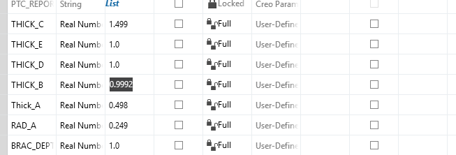
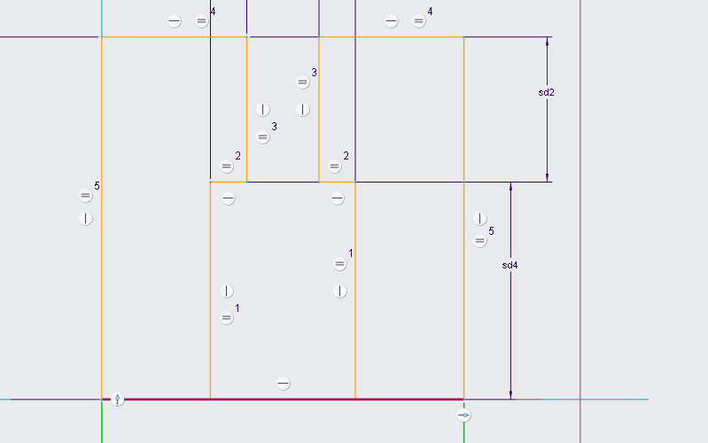
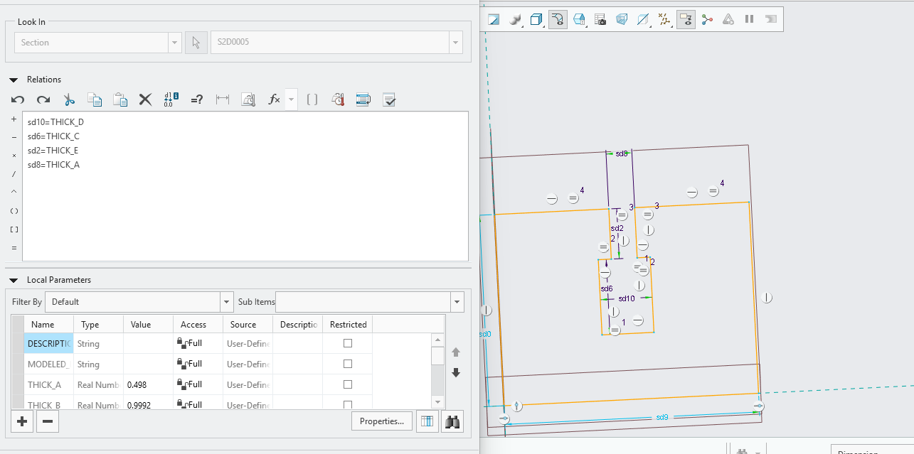
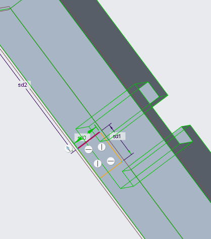
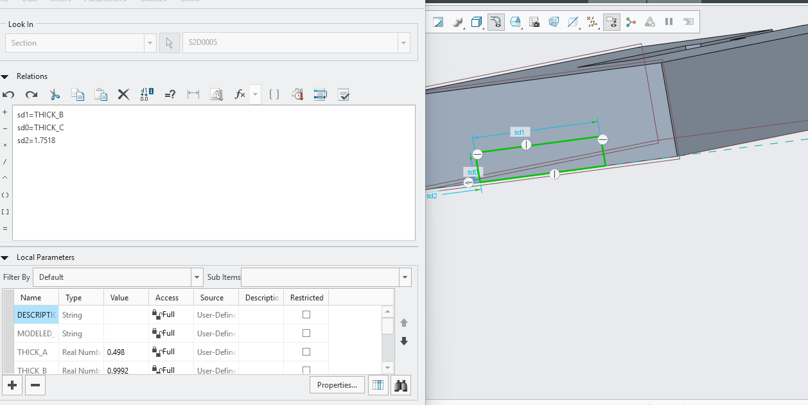
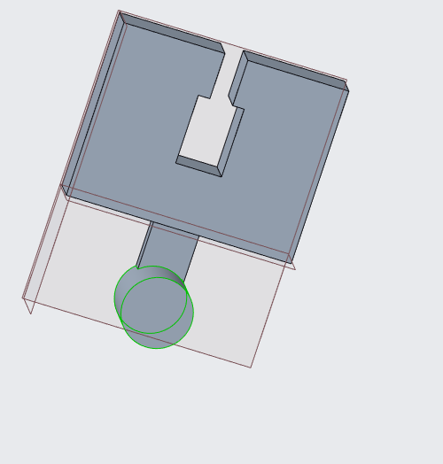
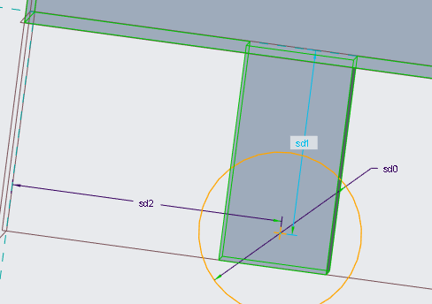
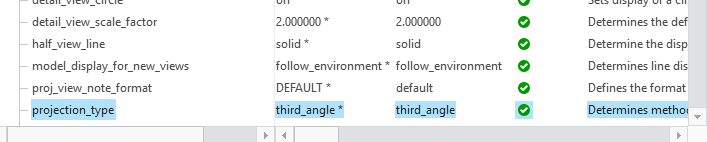
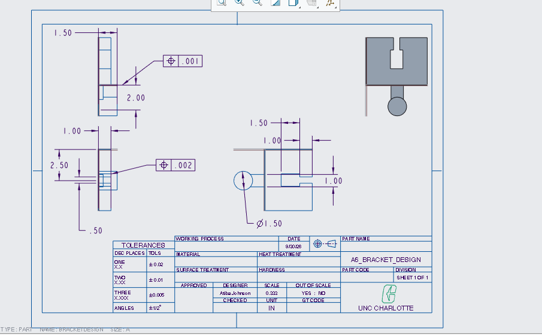

# A6 – [Bracket Design]

## Objective

To complete this Design I would need to create a cad model based on the features found from the stress and strain analysis from last weeks 
bracket design. 

## Parametric equations 

To being I had to decided what would be my parametric equations I decided to create this list. 
(All values align with last weeks assignment).

<ol>
  <li>THICK_A = The thickness of the length of the top of the web.</li>
  <li>THICK_B = The thickness of the length of the shoulder of the web.</li>
  <li>THICK_C = The thickness of the base of my web.</li>
  <li>THICK_D = The thickness of the extrusion of feature C</li>
  <li>CENTER = The Center of the feature C</li>
  <li>RAD_A = The radius of feature A</li>
  <li>BRACK_DEPTH = The depth of my bracket in general</li>
</ol>

## Cad Design Equations 

Below you can see my parametric equations being entered 

<figure>
  
  <figcaption> The first set of parametric designing</figcaption>
</figure>

## Cad Design Bracket (A)

This is my first step of feature that I created I started with this as it would be easier to create moving down than going up.
Here I would make a mistake and input the wrong dimensions and it would mess up the parametric equations as shown in the first image but it would be fixed in the second. 

<figure>
  
  <figcaption> The mistake </figcaption>
</figure>

<figure>
  
  <figcaption> The second set of parametric designing</figcaption>
</figure>  

## Cad Design Feature 2(B) 

This shows the creation of my feature B in the bracket design and which dimensions were chosen for parametric equations.  
<figure>
  
  <figcaption> The second set of parametric designing</figcaption>
</figure>  

<figure>
  
</figure>

## Cad Design Feature 3(A) 

This shows the creation of my feature A in the design the parametric dimensions were chosen below. 
<figure>
  
  <figcaption> The third set of parametric designing</figcaption>
</figure>

<figure>
  
</figure>

## Drawings 

After completing the entire bracket design I would being to start to create a engineering drawing using the templates from engr1202. 
First I would check and see if the projection angle was the right view in creo. 

<figure>
  
  <figcaption> The angle of projection </figcaption>
</figure>

After this I would begin to add the designs based off of the bracket design parent part. 

<figure>
  
</figure>

## Tolerences 

The horizontal shoulder is the most important part of the bracket because it physically supports the load. I gave it a nominal size of 0.9992 inches, but applied a +0.000 / -0.0005 inch tolerance as shown in the drawing this matches up. 

The Clearance Spaces: The top opening and the bottom cavity aren't bearing the heavy sliding load, they just need to stay out of the way so the T-beam can drop in. I gave these a slightly more forgiving tolerance of +0.000 / -0.001 inches

The tolerances did fit into what I calculated to account for real world bending. 

## Lessons Learned 

I learned like in lecture that dimensioning and tolerancing act as the primary language for communicating functional requirements 
to a manufacturer that are critical for the best final fit. For my design Applying a highly restrictive +0.000 / -0.0005 inch tolerance to the features explicitly communicates that this is a critical load-bearing interface. Signaling to the machinist that the surface must smoothly support a dynamic sliding load without bending even as little as possible. 

## Reflections 

Time spent around was 6 hours total I had to go back and fourth to find the pieces I needed to design the part. Thanks to having the stiffness and strain equations solved I was able to find the lengths and widths needed for the part, if the calculated load changed or the required Factor of Safety was increased, only the baseline parameter needed to be updated. The CAD software's relation engine automatically rescaled the necessary structural thicknesses for my bracket design. 

## Download my work:

<a href="bracketdesign.prt1" download>
  Download Cad
</a>  

<a href="bracketdesign2.drw.1" download>
  Download Drawing
</a>
